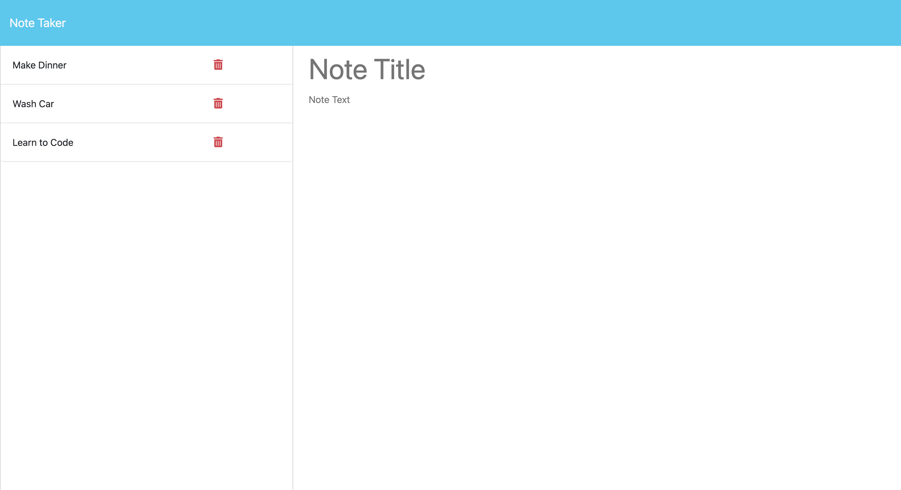

# Note Taker App

## Description
This project was created to keep track of daily tasks that need to be completed.
It combines both frontend and backend elements to allow the full functionality of
adding and deleting tasks from a data base, or in this case a json file.

## Built with
- HTML
- CSS
- JavaScript
- Node JS
- Express
- uuid npm package

## Links
[Link to Live Site]()

## Screenshot
